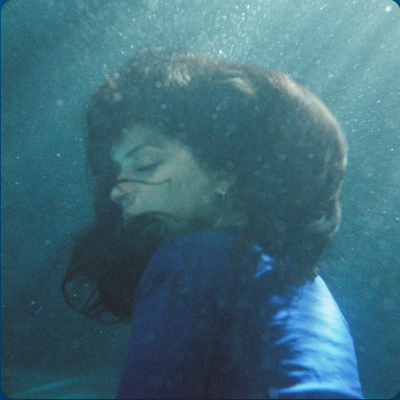
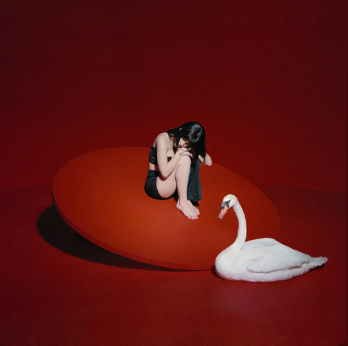
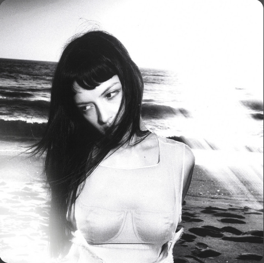
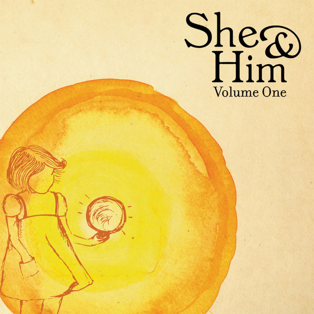

# 🎧 My Personal Sonic Universe V2: A High-Fidelity Interactive Lab

  
  
  
  

---

## 🚀 Iniciar Reproducción (Live Deployment)

Experimenta la arquitectura visual y el motor de sincronización en tiempo real a través del despliegue oficial en GitHub Pages:

  

---

## 📸 Visual Gallery & Stages

| **Stage: Deep Ocean** | **Stage: Blood Red** | **Stage: Monochrome** |
| :---: | :---: | :---: |
|  |  |  |
| *No One Noticed* | *Heavy* | *Nobody New* |

| **Stage: Golden Glow** | **Stage: Cyan Nostalgia** | **Stage: Crystal Clear** |
| :---: | :---: | :---: |
|  |  |  |
| *I Thought I Saw Your Face Today* | *Sienna* | *Lejos de Ti* |

---

## 📋 Arquitectura y Concepto del Proyecto

Este ecosistema web representa mi **laboratorio personal de desarrollo**, diseñado para trascender la reproducción de audio convencional mediante una experiencia sensorial inmersiva. El proyecto se fundamenta en tres pilares:

* **Narrativa Visual Paramétrica:** Los entornos (cromática, densidad de niebla y comportamiento de partículas) se codifican manualmente para reflejar el espectro emocional de cada track.
* **Curación Musical Íntima:** Una selección privada de composiciones que sirven como banco de pruebas para el diseño de interfaces.
* **Interpretación Semántica:** Implementación de *Meaning Boxes* que analizan la lírica y el contexto narrativo de las obras, permitiendo una conexión profunda entre el usuario y el autor.

---

## ✨ Especificaciones Técnicas de Ingeniería

### 🛠️ Core Engine (JS-Sync Engine)
* **High-Precision Time-Coding:** Algoritmo optimizado en Vanilla JavaScript para el procesamiento de archivos LRC y marcas de tiempo en formato `MM:SS.ss`, garantizando una latencia imperceptible entre el audio y el renderizado de texto.
* **Staggered DOM Injection:** Motor de manipulación de nodos que descompone cadenas de texto en fragmentos individuales (``), permitiendo animaciones de onda basadas en retardos calculados dinámicamente.
* **Atmospheric Ray-Casting & Shaders:** Implementación de efectos visuales avanzados mediante gradientes radiales múltiples, `backdrop-filter: blur()` para simular refracción de luz y animaciones de partículas no deterministas.

### 🎨 Diseño UI/UX Avanzado
* **Atomic Design Principles:** Cada componente (sliders, botones, visualizadores) sigue una jerarquía visual estricta basada en el diseño atómico.
* **Monocraft Identity:** Integración nativa de la fuente `monocraft.ttf` vía `@font-face` para asegurar una experiencia pixel-art fluida y responsiva.
* **Glassmorphism Engine:** Uso intensivo de capas de vidrio digital con bordes de alta definición para maximizar la legibilidad sobre fondos complejos.

---

## 🛠️ Stack Tecnológico de Desarrollo

  
  
  
  
  
  

---

## 🎵 Playlist & Stages (Estructura Alfabética)

| Composición | Artista | Identidad Visual Stage | Engine Status |
| :--- | :--- | :--- | :--- |
| **Heavy** | The Marías | Vampire / Crimson Red | **Stable** |
| **I Thought I Saw Your Face Today** | She & Him | Golden / Glow | **Stable** |
| **Lejos de Ti** | The Marías | Ocean / Deep Blue | **Stable** |
| **No One Noticed** | The Marías | Deep Water / Flare | **Stable** |
| **Nobody New** | The Marías | Monochrome / Grayscale | **Stable** |
| **Sienna** | The Marías | Nostalgia / Cyan | **Stable** |

---

## 👤 Perfil del Desarrollador

**Juan Navarrete (SrYor)**
* **Académico:** Estudiante de Ingeniería Industrial en Procesos Productivos (UTM).
* **Expertise:** Electrónica Analógica/Digital, Automatización Industrial, Robótica (Arduino/PLC) y Desarrollo Web.
* **Visión:** Integración de sistemas industriales con interfaces de usuario modernas y funcionales.
* **GitHub:** [@SrYorjs](https://github.com/SrYorjs)

---

## 📄 Notas Legales y Cumplimiento

Este software se distribuye bajo la licencia **MIT**. Todos los derechos de audio, composición y arte visual pertenecen exclusivamente a sus respectivos creadores (The Marías, She & Him). Este repositorio es un proyecto de **pasatiempo y exploración técnica** sin fines de lucro, diseñado para la apreciación artística y el aprendizaje de tecnologías web.

---

Made with ❤️ by SrYor
